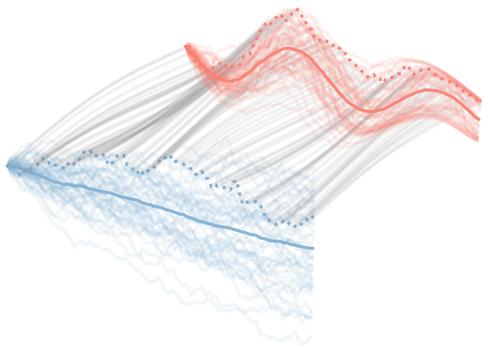

# Modeling Continuous Stochastic Process with Dynamic Normalizing Flow

Code for the paper

> Ruizhi Deng, Bo Chang, Marcus Brubaker, Greg Mori, Andreas Lehrmann. "Modeling Continuous Stochastic Process with Dynamic Normalizing Flow" (2020)
[[arxiv]](https://arxiv.org/pdf/2002.10516.pdf)


## Dependency installment

Install the dependencies in requirements.txt with
```bash
pip install -r requirements.txt -f https://download.pytorch.org/whl/torch_stable.html
```
We use a new version of PyTorch (1.4.0) for the released code. 
The experiments in the paper use an older version of PyTorch, which could lead to slightly different results.
Please read the [PyTorch documentation](https://pytorch.org/docs/stable/notes/randomness.html) for more information.

## Acknowledgements

The code make uses of code from the following two projects:
https://github.com/YuliaRubanova/latent_ode
for the paper
> Yulia Rubanova, Ricky Chen, David Duvenaud. "Latent ODEs for Irregularly-Sampled Time Series" (2019)
[[arxiv]](https://arxiv.org/abs/1907.03907)

https://github.com/rtqichen/ffjord
for the paper
> Will Grathwohl*, Ricky T. Q. Chen*, Jesse Bettencourt, Ilya Sutskever, David Duvenaud. "FFJORD: Free-form Continuous Dynamics for Scalable Reversible Generative Models." _International Conference on Learning Representations_ (2019).
> [[arxiv]](https://arxiv.org/abs/1810.01367) [[bibtex]](http://www.cs.toronto.edu/~rtqichen/bibtex/ffjord.bib)

We make use the following files from the code of *FFJORD: Free-form Continuous Dynamics for Scalable Reversible Generative Models*: `train_misc.py`, `lib/layers`, `lib/utils.py`, `lib/spectral_norm.py`.
We make changes to the file train_misc.py, lib/layers/ode_func.py, and lib/utils.py.

We use `lib/encoder_decoder.py`, `lib/ode_func.py`, `lib/diffeq_solver.py` from the code of *Latent ODEs for Irregularly-Sampled Time Series*. We make changes to the file `lib/encoder_decoder.py`.


## Command for training the model

We train the models using $\lambda=2$

### Training CTFP model on GBM Process
```bash
python train_ctfp.py --batch_size 100 --test_batch_size 100 --num_blocks 1 --save ctfp_gbm --log_freq 1 --num_workers 2 --layer_type concat --dims 32,64,64,32 --nonlinearity tanh --lr 5e-4 --num_epochs 100 --data_path data/gbm_2.pkl
```
### Training latent CTFP model on GBM Process
```bash
python train_latent_ctfp.py --batch_size 50 --test_batch_size 5 --num_blocks 1 --save latent_ctfp_gbm --log_freq 1 --num_workers 2 --layer_type concat --dims 32,64,64,32 --nonlinearity tanh --lr 5e-4 --num_epochs 100 --data_path data/gbm_2.pkl
```
### Training CTFP model on OU Process
```bash
python train_ctfp.py --batch_size 100 --test_batch_size 100 --num_blocks 1 --save ctfp_ou --log_freq 1 --num_workers 2 --layer_type concat --dims 32,64,64,32 --nonlinearity tanh --lr 5e-4 --num_epochs 100 --data_path data/ou_2.pkl --activation identity
```
### Training latent CTFP model on OU Process
```bash
python train_latent_ctfp.py --batch_size 50 --test_batch_size 5 --num_blocks 1 --save latent_ctfp_ou --log_freq 1 --num_workers 2 --layer_type concat --dims 32,64,64,32 --nonlinearity tanh --lr 5e-4 --num_epochs 300 --data_path data/ou_2.pkl --activation identity --aggressive
```


## Command for evaluating the code

We evaluate the models on data sampled by a observation process with $\lambda=2$

### Evaluating  CTFP model on GBM Process
```bash
python eval_ctfp.py --test_batch_size 100 --num_blocks 1 --save ctfp_gbm --num_workers 2 --layer_type concat --dims 32,64,64,32 --nonlinearity tanh --lr 5e-4 --num_epochs 100 --resume experiments/ctfp_gbm/pretrained.pth --data_path data/gbm_2.pkl
```
### Evaluating latent CTFP model on GBM Process
```bash
python eval_latent_ctfp.py --test_batch_size 5 --num_blocks 1 --save latent_ctfp_gbm --num_workers 2 --layer_type concat --dims 32,64,64,32 --nonlinearity tanh --lr 5e-4 --num_epochs 100 --data_path data/gbm_2.pkl --resume experiments/latent_ctfp_gbm/pretrained.pth
```
### Evaluating CTFP model on OU Process
```bash
python eval_ctfp.py --test_batch_size 100 --num_blocks 1 --save ctfp_ou --num_workers 2 --layer_type concat --dims 32,64,64,32 --nonlinearity tanh --data_path data/ou_2.pkl --activation identity --resume experiments/ctfp_ou/pretrained.pth
```
### Evaluating latent CTFP model on OU Process
```bash
python eval_latent_ctfp.py --test_batch_size 5 --num_blocks 1 --save latent_ctfp_ou --num_workers 2 --layer_type concat --dims 32,64,64,32 --nonlinearity tanh --data_path data/ou_2.pkl --activation identity --resume experiments/latent_ctfp_ou/pretrained.pth
```

## Performance Summary
| Model | GBM | OU |
|---|---|---|
| CTFP | 3.107 | 2.902 |
| Latent CTFP | 3.106 | 2.902 |

Download the data from [this link](https://drive.google.com/file/d/1ZyQ7VdL0Oe0DMMyfrB7jgoqqTcex3yVN/view?usp=sharing) for evaluating the models on GBM and OU data with $\lambda=20$ and training the models on mixture of OU data.
